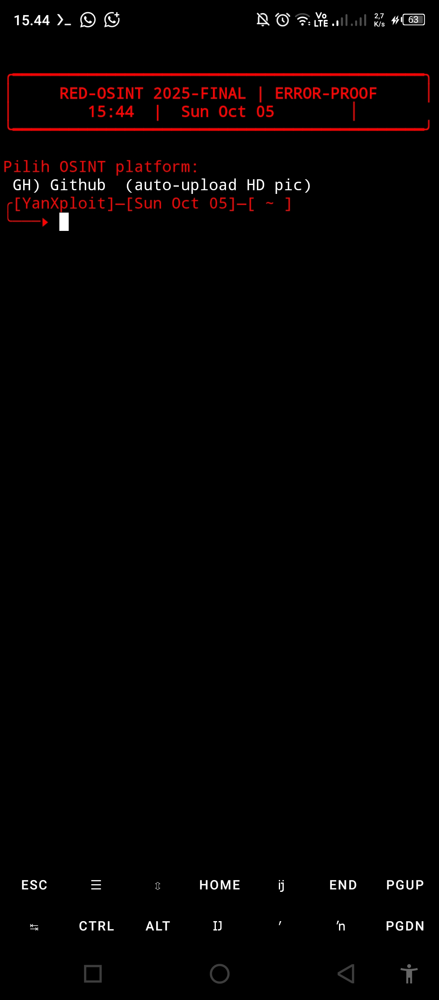

## GITHUB-OSINT
Python github Osint Free
From Base ig-osint dan red-osint
## cara run
```
pkg update && pkg upgrade
pkg install git
pkg install colorama
pkg install python-pip
git clone https://github.com/TheyanzXD/GITHUB-OSINT.git
cd GITHUB-OSINT
python GITHUB-OSINT.py
```

## PREVIEW
<h1 align="center"><code>OSINT</code></h1> <p align="center"> <br><br>


## © <a href="https://github//yanz-iyyo">the coder</a>
